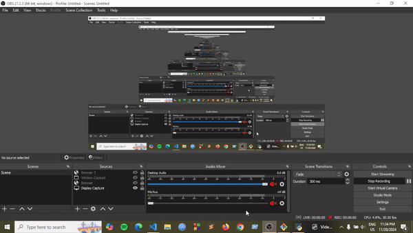

# Lab Task -2 : Simulation of UCS and A* Algorithms for Pathfinding

This task contains the implementation of Uniform Cost Search (UCS) and A* Search algorithms to navigate an agent through a grid environment. The agent collects tasks placed randomly on the grid while avoiding barriers. The project compares the performance and path costs of UCS and A* algorithms under the same environment conditions.

## Preview 



## Features
* Simulation of a grid based environment with tasks, barriers, and an agent.
* Uniform Cost Search (UCS) for pathfinding based on cumulative cost.
* A* search using the Manhattan distance as the heuristic function.
* Algorithm Toggle, Easily switch between UCS and A* algorithms during simulation.
* Real-time display of:
    * Algorithm name.
    * Tasks completed.
    * Total path cost.
    * Path details and task specific costs.
* Dynamic grid environment:
    * Randomly placed tasks.
    * Randomly placed barriers.
    * Modify the grid size, number of tasks, and barriers 


## Code Structure
* agent.py: Implements the agent's logic, including UCS and A* algorithms.
* environment.py: Manages the grid environment, including tasks and barriers.
* run.py: Handles the simulation, display, and user interactions.


## Getting Started

Ensure you have ```python``` installed with ```pygame``` library. Then run following command:
```
 git clone https://github.com/lauhemahfus/CSE366-6-Fall2024-2022-1-60-030.git
 cd CSE366-6-Fall2024-2022-1-60-030/
 cd lab_task_2/
 cd simulation/
 python run.py
```

## Observations
### Uniform Cost Search (UCS):

* Guarantees the optimal path based on actual cumulative costs.
* Performance may degrade slightly with dense barrier placements due to exhaustive exploration.

### A* Search Algorithm:

* Combines path cost and heuristic estimation (Manhattan distance).
* Usually faster than UCS, especially in sparse environments, while still providing optimal paths.

### Performance Differences
* A* tends to explore fewer nodes than UCS, making it more efficient in large grids with sparse obstacles.
* When barriers significantly restrict movement, both algorithms may take similar paths.

