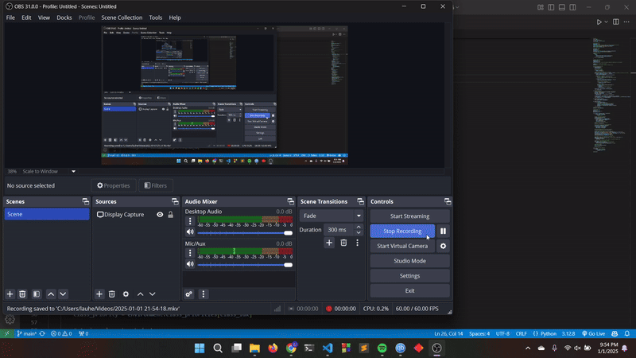

# Lab Task - 3 : Optimization using Genetic Algorithms

This assignment implements a Genetic Algorithm (GA) to optimize class scheduling while minimizing conflicts, balancing student preferences, and respecting time slot constraints. The solution includes real time visualization of schedules and fitness evaluation.

## Preview 



## Features
* Implements selection, crossover, and mutation to evolve schedules.
* Automatically identifies and penalizes scheduling conflicts.
* Incorporates student preferences into the fitness assessment.
* Displays schedules dynamically using Pygame.
* Highlights class priorities with distinct colors.
* Allows adjustment of population size, mutation rate, and generations.
* Supports varying numbers of students, classes, and time slots.


## Code Structure
* ```agent.py```: Defines the Student class, managing student information, availability, preferences, and schedule assignments.
* ```environment.py```: Sets up the scheduling environment, including classes, students, time slots, and handles the visualization using Pygame.
* ```run.py```: Executes the Genetic Algorithm, manages the evolutionary process, updates schedules, and handles the visualization loop.

## Implementation Details
### Genetic Algorithm Components
* Fitness: 
    1. Conflict Minimization: Penalize if a class is assigned to a time slot where the
    assigned student is unavailable.
    
            Conflict Penalty = Number of unavailable time slots used
    2. Preference Alignment: Reward schedules that align with student preferences for
    certain time slots.
    
            Preference Penalty = 1 / Student's Preference 
    3. Total Fitness Formula: Combine penalties for conflicts and preferences:
    
            Fitness = Conflict Penalty + Preference Penalty
    Lower fitness values indicate better schedules.
* Crossover:
    * Select a random point in the parent schedules.
    * Combine the genes (class assignments) of both parents up to the crossover
point.
* Mutation:
    * Randomly select a class and reassign it to a new student.

## Getting Started

Ensure you have ```python``` installed with ```pygame```  & ```numpy``` library. Then run following command:
```
 git clone https://github.com/lauhemahfus/CSE366-6-Fall2024-2022-1-60-030.git
 cd CSE366-6-Fall2024-2022-1-60-030/
 cd lab_task_3/
 cd simulation/
 python run.py
```